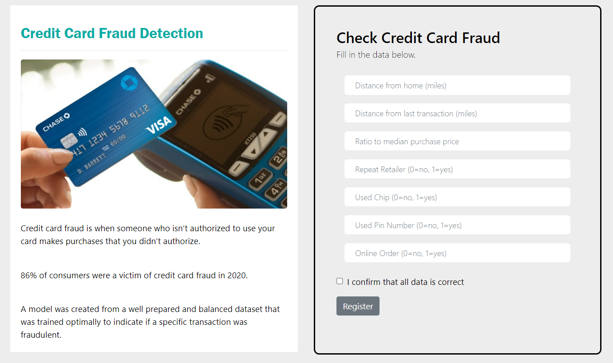

# Credit Card Fraud

Group 6 Members: Sally Mei, Debolina Bhaumik, Cole Barnes, Kanu Madhok

## Topic Overview

Digital payments and cyber criminal activities are evolving and fraud is very common for both Card-Present and Card-not present type of payments. A dataset containing information on credit card fraud was analyzed using matplotlib and machine learning classification models to determine trends in fraudulent purchases.

## Dataset

[Credit_Card_Fraud_Data](https://www.kaggle.com/datasets/dhanushnarayananr/credit-card-fraud)

## Exploratory Data Analysis

Pandas was used to import and understand the data, while sklearn was used to normalize the data, and matplotlib was used to create bar graphs.

The probability of fraud remains constant as the distance from home increases but at a certain distance, the probability spikes to its maximum value, the probability goes from 5% to 35%. 

As the distance from last transaction increases, fraud increases too.

The below bar graph shows that the probability of fraud remains constant as the distance increases but at a certain distance, the probability spikes from less than 3% all the way to 40% and then to more than 60%. Therefore, higher ratio to median purchase price increases the probability of fraud.

Also, the below graph reveals that repeat retailer don't affect the probability of a transaction being fraud.

Overall, used pin number transactions are less likely to be a fraud, while used chip transactions are more likely to be a fraud.

## Building Machine Learning Model

Since the data was unbalanced, SMOTE was used and oversampling and undersampling was done to balance the data. 

Unbalanced Data:

Balanced Data:

Then, Logistics Regression model, Random Forest Classifier model, and Decision Trees were created. As a result, the accurracy and precision for both models and Decision Trees for the balanced data by oversampling and undersampling were high since they were either at 1 or very close to 1 (see below images of results). 

### Oversampling Accuracy and Precision

Logistic Regression:

Random Forest Classifier:

Decision Trees:

### Undersampling Accuracy and Precision

Logistic Regression:

Random Forest Classifier:

Decision Trees:

## Webpage Development

HTML and CSS  was used for webpage development. A brief description on credit card fraud & its significance was included along with a form that uses ML model to depict whether credit card transaction was legit or fraudulent once the fields are completed with data.

## Flask & Heroku or Other Application

## Conclusion

The probability of fraud remains constant as the distance from home increases but at a certain distance, the probability spikes to its max value. Also, as distance from last transaction increases, fraud increases too. In addition, used pin number transactions are less likely to be a fraud, while used chip transactions are more likely to be a fraud.

